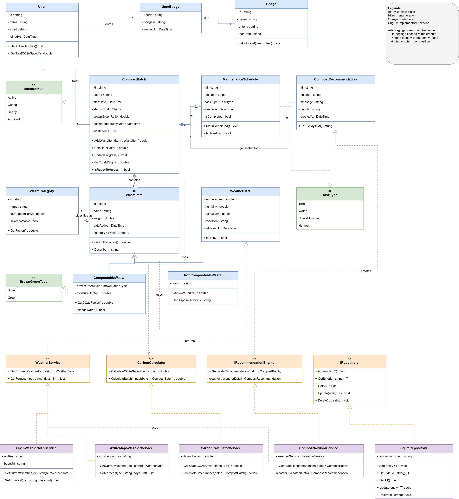
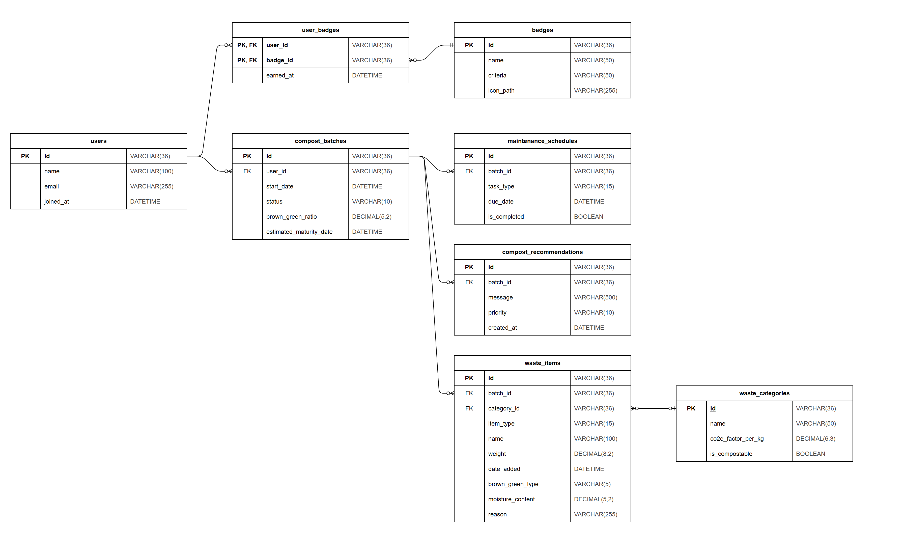

# composta

Aplikasi desktop C# (WPF) yang membantu mengubah sampah organik menjadi kompos secara optimal melalui rekomendasi berbasis data cuaca real-time, sekaligus melacak estimasi emisi CO2e yang berhasil dicegah. Dibangun untuk mendukung aksi iklim (Climate Action) skala rumah tangga dan petani urban.

Kelompok Composta  
Ketua Kelompok: Nayla Thalita - 24/535820/TK/59467  
Anggota 1: Nabil Aufa Danaputra - 24/535223/TK/59357  
Anggota 2: Gilbert S. H. Nainggolan - 24/54341/TK/60447  

## Class Diagram

   

## Entity Relationship Diagram (ERD)

Penjelasan relasi antar entitas serta tipe data dan besaran tiap atribut ada di [docs/erd.md](docs/erd.md).
File sumber diagram: [docs/erd-composta.drawio](docs/erd-composta.drawio), skema SQL: [docs/schema.sql](docs/schema.sql).
